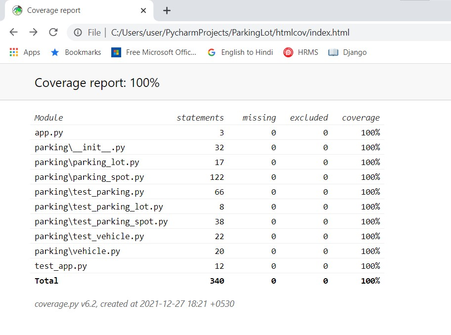

# ParkingLot
 
## Instructions to run the Parking Lot application.
* Download the ParkingLot project from GitHub and unZip the project
* Import the project in IDE or the appliction can be directly accessed via command prompt as well.

#### Running code from command prompt: (_assuming python is installed and configured in local system_)
* Open commond prompt
* Execute the following in command prompt
    * cd code/location/directory/in/local/ParkingLot
    * pip install -r requirements.txt
    * python app.py
    * Enter TOTAL #SLOTS in parking area = 8
    * Mention Parking ENTRY GATE number(s) (space separated) = 1 5 8
    * Choose a value as per Operation to be performed:
        * Please choose your action
        * Enter "P" to "PARK" your vehicle
        * Enter "U" to "UN-PARK" your vehicle
        * Enter "S" for "STATUS" of Parking Lot
        * Enter "H" to "SEARCH" your vehicle(s)
        * Enter "Q" to "QUIT" Parking Lot Application

#### PARKING example
* Enter Registration Number (mandatory)
* Enter Vehicle Type (mandatory)
* Enter Color (not mandatory)
* Enter Make (not mandatory)
* Enter ONE Entry Gate value

#### UN-PARK example
* Enter Registration Number (mandatory)

#### STATUS example
* Just choosing 's' option is enough

#### SEARCH (as per Criteria)

* Please choose a Criteria for SEARCHING vehicle(s):
    * Enter "R" for "REGISTRATION NUMBER(s)"
        * mutiple registration numbers can be added, space separated
    * Enter "V" for "VEHICLE TYPE"
        * enter any ONE vehicle type
    * Enter "C" for "COLOR"
        * enter any ONE color
    * Enter "M" for "MAKE"
        * enter any ONE make

#### LIMITATIONS
* Vehicles can be added with duplicate Registration Number
    * can be fixed with Database connection (UNIQUE constraint)
* All the testings/operations has to be done one session
    * quitting the application refreshes the data
    * can be fixed with Database connection

#### RUNNING TEST CASES

**Enter following in command prompt**

 * pytest -s -v --cov=. --cov-report=html
     * Enter TOTAL #SLOTS in parking area = **8**
     * Mention Parking ENTRY GATE number(s) (space separated) = **1 5 8**

